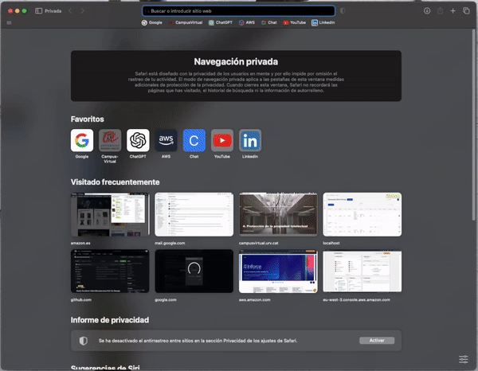

# OAuth2 User Profile with Spring Boot

## Description

This project is a simple web application built with Spring Boot that allows users to log in using OAuth2 with GitHub. After authenticating, users can view a detailed profile displaying information directly pulled from their GitHub account, such as their name, bio, avatar, and repository statistics.

## Features

- **Login with OAuth2 (GitHub)**
- **User profile view with details fetched from GitHub**
- **Custom homepage displaying authentication status**
- **Attractive and modern user interface using Thymeleaf**

## Prerequisites

Before you begin, make sure you have the following installed:

- **Java 17 or higher**
- **Maven 3.6.3 or higher**
- **A GitHub account with an OAuth app configured** ([GitHub OAuth App Setup Instructions](https://docs.github.com/en/developers/apps/building-oauth-apps/creating-an-oauth-app))

## Setup

1. **Clone the repository**

   ```bash
   git clone https://github.com/carlosmgv02/Oauth2-github-example.git
   cd Oauth2-github-example
```
 
1. **Configure OAuth2 credentials** Open the `src/main/resources/application.yml` file and replace `your-github-client-id` and `your-github-client-secret` with your GitHub OAuth app credentials.

```yaml
spring:
  thymeleaf:
    prefix: classpath:/templates/
    suffix: .html
  security:
    oauth2:
      client:
        registration:
          github:
            client-id: your-github-client-id
            client-secret: your-github-client-secret
            scope: user
            redirect-uri: "{baseUrl}/login/oauth2/code/{registrationId}"
        provider:
          github:
            authorization-uri: https://github.com/login/oauth/authorize
            token-uri: https://github.com/login/oauth/access_token
            user-info-uri: https://api.github.com/user
            user-name-attribute: login
github:
  api:
    url: https://api.github.com
```

2. **Build and run the application**
   Run the following commands to build and run the application:


```bash
./mvnw clean install
./mvnw spring-boot:run
```

3. **Access the application** Once the application is running, open your browser and navigate to `http://localhost:8080`. From there, you can log in with your GitHub account and view your user profile.

## Usage

### Homepage

The homepage allows you to log in with your GitHub account. Once authenticated, you can see your name and a link to view your profile.

### User Profile

After logging in, you can access the profile page where detailed information about your GitHub account will be displayed, including your name, avatar, bio, number of public repositories, and more.


## Demo


Here’s a live demonstration of the login process and the user profile view in action.

